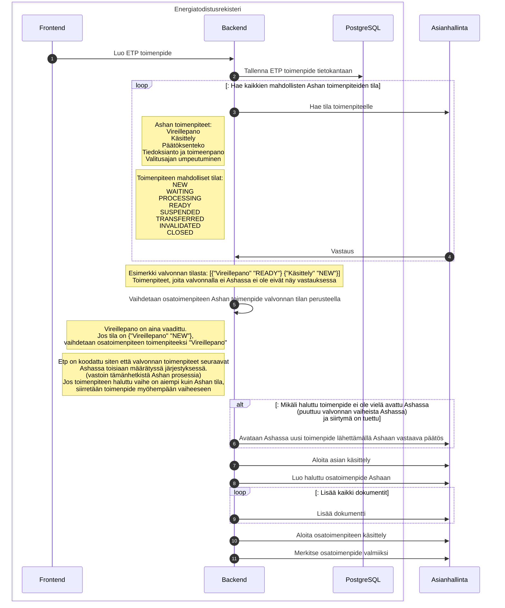

# Asianhallinta-integraation kuvaus

Energiatodistusrekisteri on integroitu kolmannen osapuolen asianhallintajärjestelmän kanssa. Korkeamman tason kuvaus ja
linkkejä muuhun dokumentaation Confluencessa https://knowledge.solita.fi/display/AE/Asianhallinta+ASHA.

Tämä dokumentti pyrkii kuvaamaan järjestelmän toiminnan tarkemmalla tasolla

## log-toimenpide! funktion logiikka

### Käsitteistöä

| Käsite            | Merkitys                                                                                                                        |
|-------------------|---------------------------------------------------------------------------------------------------------------------------------|
| Valvonta          | Ylätason käsite. Esimerkiksi myynnissä olevasta kohteesta ilman energiatodistusta voidaan aloittaa valvonta                     |
| ETP               | Energiatodistusrekisteri                                                                                                        |
| Asha              | Asianhallintajärjestelmä, johon valvonnan tila ja dokumentit tallennetaan. Myös ETP tallentaa toimenpiteet, muttei dokumentteja |
| Toimenpide (ETP)  | Valvonnan osa, josta tulee merkintä myös Ashaan. Ashassa osatoimenpide. Kuuluu Ashassa aina Ashan toimenpiteeseen               |
| Toimenpide (Asha) | Valvonnan osa. Voi sisältää useita osatoimenpiteitä, eli ETP:n toimepiteitä                                                     |
| Päätös            | Ashan operaatio, jolla toimenpide lopetetaan ja siirrytään seuraavaan                                                           |
| Toimenpiteen tila | Ashan toimenpiteen tila, mahdollisia arvoja esimerkiksi NEW tai READY                                                           |

